## 👋 Hey there, I'm **...**

---

## 🎓 About Me

**Computer Science & Engineering Student @ Chung-Ang University**  
🚀 Building experiences that bridge stunning frontend visuals with robust backend power  
🌟 Passionate about crafting elegant, scalable solutions through clean code  
💡 Always exploring cutting-edge technologies and contributing to open source  
💪 Aspiring to become an exceptional Product Manager & Full Stack Developer

---

## 🌍 My Journey

```mermaid
%%{init: {
  "theme": "base",
  "themeVariables": {
    "primaryColor": "#36BCF7",
    "primaryTextColor": "#ffffff",
    "primaryBorderColor": "#1e40af",
    "lineColor": "#36BCF7",
    "sectionBkgColor": "#36BCF7",
    "altSectionBkgColor": "#2563eb",
    "gridColor": "#36BCF7",
    "secondaryColor": "#2563eb",
    "tertiaryColor": "#1e40af"
  }
}}%%
timeline
    title My Life Timeline
    2003        : Born in Seoul 🇰🇷
    2008-2013   : Living in Minnesota 🇺🇸
                : Experiencing American culture
    2013        : Return to Seoul 🏠
    2016-2018   : Whimoon Middle School 📚
    2019-2021   : Joongdong High School 🎓
    2023-       : Chung-Ang University 🏛️
                : Computer Science & Engineering
```

---

## 🏗️ Featured Projects

<table>
<tr>
<td width="50%">

### 🎲 윷놀이 Game (Spring 2025)
**Traditional Korean Board Game**
- Built with Java Swing & JavaFX
- Full MVC architecture implementation
- Custom board shapes and game logic

</td>
<td width="50%">

### 🔍 SLR(1) Parser (Spring 2025)
**Compiler Theory Implementation**
- Context-free grammar parser
- SLR(1) parsing table generation
- Academic project for Compilers course

</td>
</tr>
<tr>
<td width="50%">

### 💕 lovemap (Spring 2025)
**Comprehensive Dating Platform**
- Open-source dating application
- Modern web technologies
- Currently backend is N/A.

</td>
<td width="50%">

### 🧩 Tetris Game (Summer 2025)
**Classic Game Recreation**
- Built with React
- Responsive design
- Deployed on GitHub Pages

</td>
</tr>
<tr>
<td colspan="2">

### 💰 ProjectExpense (Summer 2025)
**Personal Finance Tracker**
- Full-stack web application for expense tracking
- Clean, intuitive interface for financial management
- Separate frontend and backend repositories

</td>
</tr>
</table>

### 🔍 Explore More

---

## 🛠️ Tech Stack

### Frontend

### Backend

### Database & Tools

---

## 🤝 Let's Connect!

💬 **Open to collaborations and interesting conversations.**  

---

### 💫 *"Code is poetry written in logic"*

